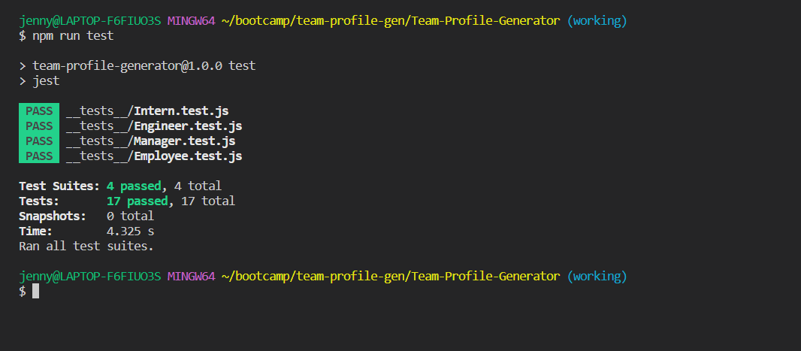
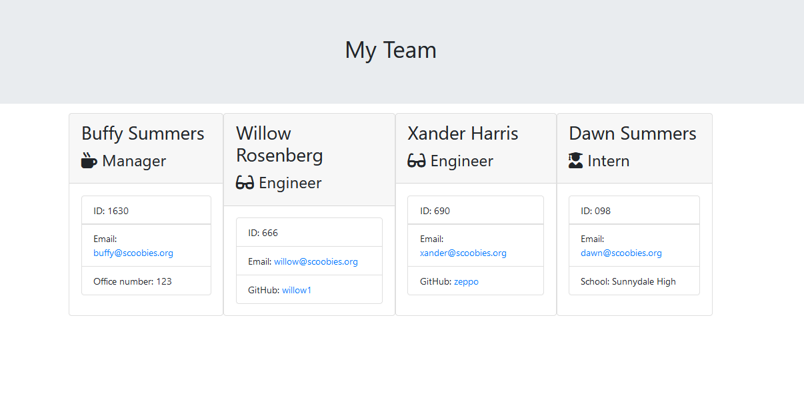
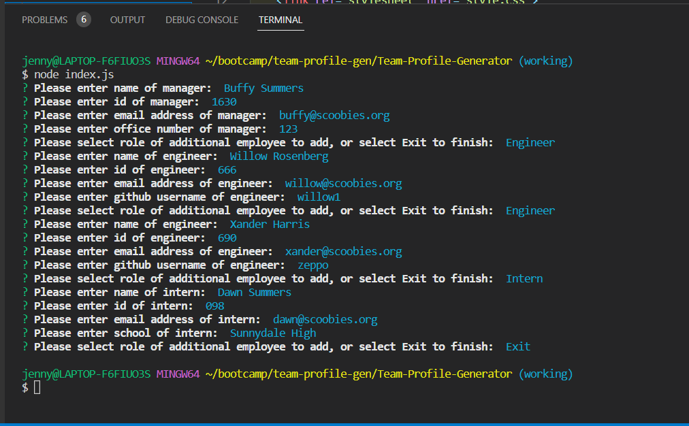

# Team Profile Generator
Created by Jennifer Hull using starter code from edx skills for life font-end web dev bootcamp.

## Description

This is a CLI node application that lets the user build a team profile by answering prompts.

-----

## Installation and Usage

The application can be run in command line but requires the user to have node and npm inquirer (this uses version 6, anything below 9 should work) installed.

The user can launch the application in command line with the command 'node index.js'. The user is first required to add a team manager, and can then select whether to add an intern or engineer. This option is repeated for the user so they can add multiple interns or engineers. In the prompts, each team member requires a name, id and email address; Additionally, Managers need an office number, Engineers need a GitHub username, and Interns need a school.

Once the full team has been added the user can select 'Exit'. This will generate the html file in the output folder. 

This file can be launched in browser to view it, and can be copied and used elsewhere. The HTML file is preformatted with some bootstrap components. Additional styling could be applied to the HTML file either in a `<style>` tag or using an external style sheet.

For an example of the prompts and the generated HTML page see [images](#images) below.

-----

## Development

This application was built in JavaScript and uses object-oriented programming, including classes and class extension/inheritance to organise the input from the user per employee role, and methods to call that data into the template. 

The application also uses node and npm:

* Node require is used for modularisation of each class object.
* npm inquirer is used for asking the user questions in order to build the team. 
* node fs is used to write the HTML file, and a template literal is used to structure the html file around the content.
* Node path is used to send the generated file to a specific directory (the 'output' folder).

The page template for the html was provided in the starter code and includes HTML and array methods including .push and .join.

-----

## Tests

This application used the npm package jest for testing the lib files. The tests were to check that the objects and their methods were written properly. As you can see in the image below, all 17 tests passed. To view the test files please see the `__tests__` folder in the repo.

### Screenshot of tests passing

Tests run using jest show all tests pass.

-----

## My Experience

Building this application was difficult because I had struggled with the concept of object-oriented programming and classes/inheritance. I did find making this helpful as practise.

I was also very confused when learning about test driven development. I still find the tests themselves a bit confusing, but was able to make all tests pass by using the error messages on the failed tests as guidance. I can definitely see the benefit of TDD.

I enjoyed implementing node and npm packages in the command line.

-----

## Links
Link to repo for this application:
https://github.com/jh871/Team-Profile-Generator

-----

## Images

### Screenshot of generated html page
Generated html page loaded in live server showing team as generated in terminal via inquirer.

### Screenshot of running node in command line
Terminal window showing node being run with index.js. The inquirer prompts along with the answers provided for the html output file can be seen.
